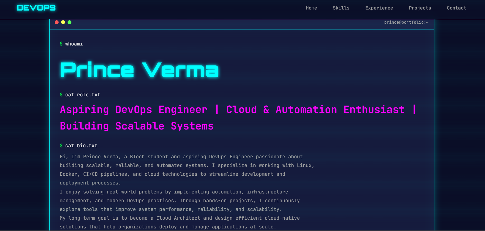

# 🌐 Prince Verma – DevOps Portfolio

Hi 👋 I'm **Prince Verma**, a BTech student passionate about **DevOps, Cloud Computing, and Automation**.
This repository contains my **personal developer portfolio website** showcasing my skills, projects, and DevOps journey.

---

## 🚀 Live Portfolio

🔗 **View Website:**
https://prince-portfolio-lake.vercel.app/  

---

## 🧑‍💻 About Me

* 🎓 BTech Student
* ☁️ Aspiring **DevOps Engineer & Cloud Architect**
* 🐧 Passionate about **Linux, Automation, and Infrastructure**
* 🔧 Building real-world **DevOps and Cloud projects**

---

## 🛠 Tech Stack

**Frontend**

* HTML
* CSS
* JavaScript

**DevOps / Cloud Tools**

* Docker
* Kubernetes
* Jenkins
* Terraform
* AWS
* Git & GitHub

---

## 📂 Project Structure

```
PORTFOLIO
 ├── index.html
 ├── README.md
 ├── images
    ├──portfolio.png

```

---

## ⚙️ Deployment

This portfolio is deployed using modern cloud platforms.

* Version Control: Git & GitHub
* Deployment Platform: Vercel
* CI/CD Ready

---

## 📸 Portfolio Preview

*Add screenshots of your portfolio here*

```

```

---

## 📬 Connect With Me

💼 LinkedIn
🐙 GitHub
📧 Email

---

⭐ If you like this project, consider **starring the repository**!
