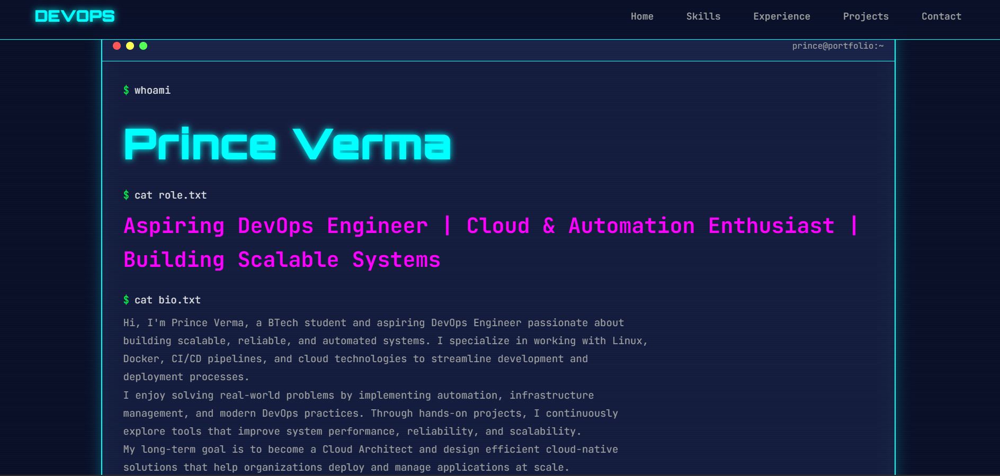

# 🌐 Prince Verma – DevOps Portfolio

Welcome to my personal portfolio website! 🚀

This portfolio showcases my **DevOps journey**, technical skills, projects, certifications, and professional experience in **Cloud Computing, DevOps, and Infrastructure Automation**.

> **Live Website:**  
> 🌍 https://prince-portfolio-lake.vercel.app/

---

# 👨‍💻 About Me

Hi, I'm **Prince Verma**, a Computer Science graduate passionate about building scalable, secure, and automated cloud infrastructure.

I enjoy designing CI/CD pipelines, deploying applications on Kubernetes, automating cloud infrastructure with Terraform, and implementing DevSecOps best practices.

I'm continuously learning and building real-world cloud-native solutions using modern DevOps tools.

---

# 🚀 Features

- 👋 Professional introduction
- 💼 Experience & Career Journey
- 🛠 Technical Skills
- ☁️ DevOps & Cloud Projects
- 📜 Certifications
- 📄 Downloadable Resume
- 📱 Responsive Design
- 🌙 Modern UI & Smooth Animations
- 📬 Contact Section
-  CI/CD for Automatic Deployment

---

# 🛠 Tech Stack

## Frontend

- HTML5
- CSS3
- JavaScript

## DevOps & Cloud

- AWS
- Docker
- Kubernetes
- Jenkins
- GitHub Actions
- Terraform
- Ansible
- Linux
- Git & GitHub

## Monitoring & DevSecOps

- Prometheus
- Grafana
- SonarQube
- Trivy

---

# 📂 Project Structure

```
PORTFOLIO
 ├── index.html
 ├── README.md
 ├── images
    ├──portfolio.png

```
---

# 🌟 Highlights

- ☁️ Cloud Infrastructure using AWS
- ☸️ Kubernetes Deployments
- 🐳 Docker Containerization
- 🚀 CI/CD Automation
- 🏗 Infrastructure as Code (Terraform)
- 🔐 DevSecOps Integration
- 📊 Monitoring & Observability
- 📱 Responsive Portfolio Design

---

# 🚀 Featured Projects

- 🚀 TaskFlow – DevOps Task Management Platform
- ☁️ SaaS Landing Page Deployment on AWS EKS
- 🎥 NovaMeet Infrastructure Automation
- 🏗 Infrastructure Automation using Terraform
- 📈 Kubernetes Monitoring with Prometheus & Grafana

---

# 📸 Portfolio Preview

> 

---

# ⚙️ Getting Started

Clone the repository

```bash
git clone https://github.com/Princepodwalverma/portfolio.git
```

Navigate to the project

```bash
cd portfolio
```

Open the website

```bash
index.html
```

Or use **Live Server** in VS Code.

---

# 🚀 Deployment

The portfolio is deployed on **Vercel**.

### Live URL

https://prince-portfolio-lake.vercel.app/

---

# 📈 Future Improvements

- Blog Section
- Dark/Light Theme Toggle
- Project Filtering
- Visitor Analytics
- Interactive Terminal
- More DevOps Projects

---

# 🤝 Connect With Me

🌐 **Portfolio**  
https://prince-portfolio-lake.vercel.app/

💼 **LinkedIn**  
https://linkedin.com/in/prince-verma-579444246

💻 **GitHub**  
https://github.com/Princepodwalverma

📧 **Email**  
podwal.work@gmail.com

---

# ⭐ Support

If you found this portfolio helpful or inspiring, please consider giving this repository a **⭐ Star**.

It helps others discover my work and motivates me to keep building awesome projects!

---

## Made with ❤️ by Prince Verma
